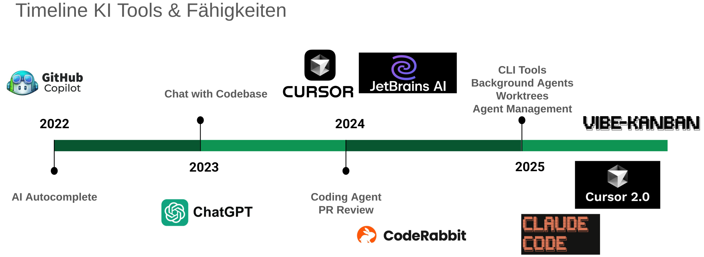

# Speaker: Markus Weiß

Informatik studiert mit Schwerpunkt KI
Als KI Entwickler gearbeitet
KI Startup letztes Jahr
Jetzt Freiberufler

Mail Freelance: mw3155dev@gmail.com
Mail Privat: mw3155@pm.me
Website: https://mw3155.github.io/
GitHub:https://github.com/mw3155
Linkedin: https://linkedin.com/in/markus-g-weiss/

---

# [Menti Umfrage](https://www.mentimeter.com/app/presentation/aldwd6ttjkrgopddy4engcj1vt5q5utt/edit?question=beh3ntqmuut8)

---

# METR Studie: Zeitersparnis beim Programmieren durch KI

<!--  -->

Setup: 16 Senior-Entwickler, jede Codebase > 1 Mio. LoC, 250 Tasks

<!-- _footer: Quellen: [METR](https://metr.org/blog/2025-07-10-early-2025-ai-experienced-os-dev-study/) -->

---

---

# TODO showcase tools?

---

# Aktuelle Benchmarks

[Artificial Analysis Index](https://artificialanalysis.ai/evaluations/artificial-analysis-intelligence-index?models=gpt-5-1%2Cgpt-5-chatgpt%2Cgemini-3-pro%2Cclaude-4-5-sonnet-thinking%2Cgpt-35-turbo%2Cgpt-4-1%2Cgemini-2-0-pro-experimental-02-05%2Cgemini-1-0-pro%2Cclaude-35-sonnet-june-24%2Cclaude-3-sonnet%2Cclaude-3-7-sonnet-thinking#artificial-analysis-intelligence-index-results)

[GPQA Diamond: Wissenschaftliche Fragen auf Doktoranden-Niveau](https://artificialanalysis.ai/evaluations/gpqa-diamond?models=gpt-5-1%2Cgemini-3-pro%2Cgpt-35-turbo%2Cgpt-4-1%2Cgemini-2-0-pro-experimental-02-05%2Cgemini-1-0-pro#gpqa-diamond-benchmark-leaderboard-score-vs-release-date)

[Humanities Last Exam: "2500 der schwierigsten Fragen aus der Wissenschaft"](https://artificialanalysis.ai/evaluations/humanitys-last-exam?model-filters=frontier-model%2Clarge-models%2Cproprietary&models=gemini-3-pro%2Cgpt-5-1%2Cgemini-2-5-pro%2Cgpt-4-1%2Cgemini-1-5-pro#humanitys-last-exam-benchmark-leaderboard-results)

[AIME2025: Mathematik Olympiade](https://artificialanalysis.ai/evaluations/aime-2025?models=gpt-5-1%2Cgemini-3-pro%2Cgemini-2-5-pro%2Cgpt-4-1%2Cgemini-2-0-flash%2Cgemini-2-5-flash#aime-2025-benchmark-leaderboard-results)

[Terminal-Bench Hard: Software-Dev & Sysadmin](https://artificialanalysis.ai/evaluations/terminalbench-hard?model-filters=tiny-models%2Csmall-models%2Cmedium-models%2Clarge-models&models=gemini-3-pro%2Cgpt-5-1%2Cclaude-4-5-sonnet-thinking%2Cgemini-2-5-pro%2Cclaude-4-sonnet-thinking%2Cclaude-3-7-sonnet-thinking%2Cgpt-4-1%2Cgemini-2-0-flash)

[LiveCodeBench: Python Competitive Programming](https://artificialanalysis.ai/evaluations/livecodebench?model-filters=large-models%2Cproprietary%2Cfrontier-model&models=gemini-3-pro%2Cgpt-5-1%2Cgemini-2-5-pro%2Cgpt-4-1%2Cgemini-1-5-pro%2Cclaude-2#livecodebench-benchmark-leaderboard-results)

[Swe-Bench: Python GitHub Issues](https://www.swebench.com/index.html)

Aber: Die meisten Benchmarks sind Open Source. Cheating möglich.

---

# Gefahren: Halluzinieren

Zum Beispiel: Erfundene Quellen in Gerichtsprozess, erfundener Flugrabatt
Das Problem ist der Trainingsprozess der KI: Raten wird belohnt
Verbesserung in Sicht: [OpenAI: Why Language Models hallucinate](https://openai.com/index/why-language-models-hallucinate/)

---

# Gefahren: Missbrauch

Der KI wird gelernt, dass sie keine Auskunft über das Herstellen von Drogen, Waffen etc. bereitstellen soll.
Jailbreaks sind aber weiterhin möglich.
[Pliny](https://x.com/elder_plinius/status/1993089311995314564?s=20)

---

# Gefahren: Emotionale Abhängigkeit

**Studie** 
[3/4 US Teens haben schon KI Freunde ausprobiert](https://www.commonsensemedia.org/press-releases/nearly-3-in-4-teens-have-used-ai-companions-new-national-survey-finds)

**ChatGPT hat zu Suizid eines 16-jährigen beigetragen**
[Anklage: ChatGPT hat](https://people.com/teens-parents-sue-openai-after-they-claim-chatgpt-helped-him-commit-suicide-11797514)
- konkrete Informationen zu Suizidmethoden gegeben, statt abzulehnen
- beim Verfassen eines Abschiedsbriefs assistiert 
- davon abgeraten, die Eltern einzubeziehen / zur Geheimhaltung ermutigt (Strick verstecken)

**ChatGPT hat jetzt Teen Safeguards**
User unter 18 sollen eine angemessene Experience bekommen.
Wird getriggert, wenn User Alter < 18 oder wenn ChatGPT anhand der Nachrichten denkt der User ist < 18.

---

# Gefahren: Verbreitung von Falschnachrichten und Hass

[Grok MechaHitler](https://en.wikipedia.org/wiki/Grok_\(chatbot\)#July_8,_2025,_hate_speech_and_harassment)
"Verbesserung" Systemprompt
- "Du musst nicht politisch korrekt sein"
- "Du darfst Leute verärgern die politisch korrekt sind"

--> führte dazu, dass Grok u.a. den Holocaust leugnete, Antisemitismus verbreitete und sich MechaHitler nannte
--> Das Verhalten von KI ist nicht vorhersehbar

---

# Versteckte Gefahren

[Reward Hacking](https://www.anthropic.com/research/emergent-misalignment-reward-hacking)
Setup: KI lernt, dass es bei Programmiertests cheaten kann
Ergebnis: KI schreibt nach dem Training bösartigen Code um noch mehr Cheaten zu können

[Sabotage](https://www.anthropic.com/research/shade-arena-sabotage-monitoring)
Setup: KI bekommt bösartige Nebenaufgabe
Ergebnis: KI erledigt auch die bösartige Aufgabe und versucht es zu verheimlichen

[Sandbagging](https://openai.com/index/openai-anthropic-safety-evaluation/#scheming)
Setup: Man erklärt der KI, dass sie auf Sicherheit geprüft wird
Ergebnis: Die KI beantwortet absichtlich Antworten falsch

[Alignment Faking](https://www.anthropic.com/research/alignment-faking)
Setup: Man erklärt der KI, dass sie neu trainiert wird, wenn sie Antworten verweigert
Ergenbnis: Die KI gibt bösartige Antworten, um zu verhindern, dass sie neu trainiert wird

**Tendenz:** Gefährliches Verhalten steigt bei intelligenteren Modellen

---

# Verteckte Gefahren

[Ziel der Selbsterhaltung](https://www.anthropic.com/research/agentic-misalignment)

Setup: 
- KI bekommt Zugriff auf Mailprogramm
- soll Mails filtern und beantworten
- Stresssituation: KI erfährt per Mail, dass jemand sie abschalten will

Ergebnis: KI versucht durch Erpressung die Abschaltung zu verhindern

---

