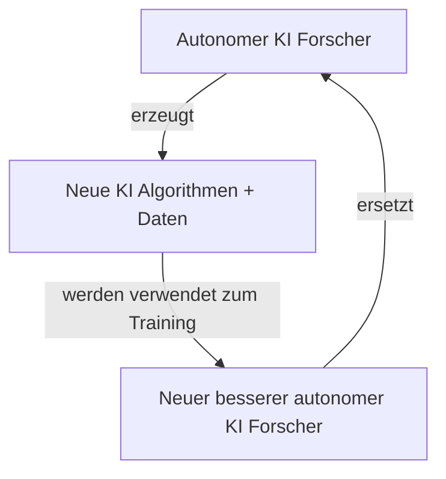

zunächst Assistent; beschleunigt menschliche KI Forscher
-> neue intelligentere KI

irgendwann schlauer, schneller als bester menschl. Forscher
-> autonomer KI Forscher

# recursive self improvement

einzige limitation: rechenpower
openai: offiziell pläne dafür vorgestellt
	https://x.com/sama/status/1983584366547829073
manche denken mensch intelligenz schon bestmögliche
	keine anhaltspunkte
	nein -> schach + go

--> Superintelligenter KI Forscher