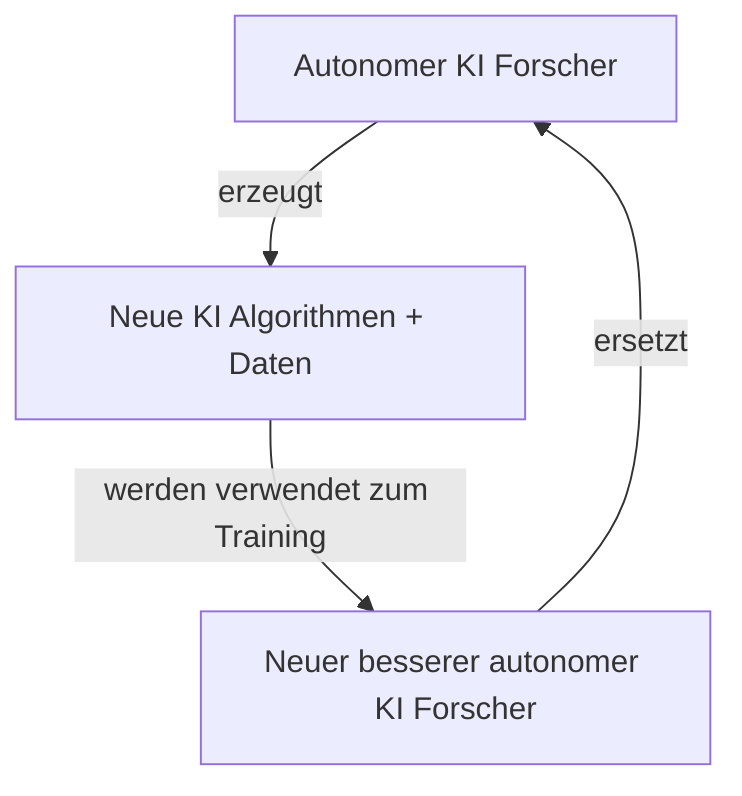

# SuperKI Talk - TechCamp

## Table of Contents
1. [Wer bin ich](#wer-bin-ich)
2. [Umfragen](#umfragen)
3. [Status Quo](#status-quo)
4. [KI Forschung](#ki-forschung)
5. [Autonomer KI Forscher](#autonomer-ki-forscher)
6. [Superintelligenter KI Forscher](#superintelligenter-ki-forscher)
7. [Vergleich SuperKI vs Mensch](#vergleich-superki-vs-mensch)
8. [SuperKI Gefahr Blackbox](#superki-gefahr-blackbox)
9. [SuperKI Gefahr Unkontrollierbar](#superki-gefahr-unkontrollierbar)
10. [SuperKI Werte nicht programmierbar](#superki-werte-nicht-programmierbar)
11. [Stimmen aus Forschung und Industrie](#stimmen-aus-forschung-und-industrie)
12. [Lösung](#lösung)

---

## Wer bin ich

**Kontakt:**
- mw3155dev@gmail.com (freelance)
- mw3155@pm.me (privat)
- https://github.com/mw3155
- https://mw3155.github.io/

**Hintergrund:**
- Informatik studiert schwerpunkt KI
- Als KI entwickler gearbeitet
- KI startup letztes jahr
- Jetzt freiberufler

**Hinweise:**
- Werde nicht bezahlt um das buch vorzustellen
- (if anybody builds it everybody dies)
- Nicht in mission von DCN

---

## Umfragen

**Teilnehmerzahl:** 22 leute

**Wer nutzt regelmäßig KI (chatgpt, copilot, cursor)**
- 20 leute

**Wer denkt dass KI schlauer als mensch werden kann**
- 12.5

**Wer denkt man sollte KI Forschung verbieten (Anfang)**
- 1 verbieten
- 1 militär
- 1 regulieren

**Umfrage am Ende: Wer denkt man sollte KI Forschung verbieten**
- 3x verbieten

**Feedback:** Meiste leute: Politik bringt nix; siehe atomabkommen derzeit; einfach hoffen dass es gut ausgeht

---

## Status Quo

### KI Programmier Assistent

- ChatGPT, autocomplete, agenten in IDEs
- Bestimmt nicht perfekt, aber besser als 2022? Auf jeden fall

**Aktuell Benchmarks:**
- Lösen von schwierigen wettkampf aufgaben
  - https://llmdb.com/benchmarks/codeforces
- Lösen von github issues
  - https://llm-stats.com/benchmarks/swe-bench-verified

**Stetige Verbesserung:** Neue daten relativ einfach generierbar (neue aufgaben + tests)

**Sprachen:** Nur python und c++. Aber genau das ist für forschung wichtig!

---

## KI Forschung

KI forschung = recherche, experimente mit python, bericht schreiben

**Transformer paper:**
- Idee attention formel (sonst nix)
- https://arxiv.org/html/1706.03762v7

**Jetzt schon sehr gut automatisierbar:**
- https://sakana.ai/ai-scientist/
- https://sakana.ai/ai-scientist-first-publication/

---

## Autonomer KI Forscher

**Zunächst Assistent:**
- Beschleunigt menschliche KI Forscher
- Neue intelligentere KI

**Irgendwann:**
- Schlauer, schneller als bester menschl. Forscher
- Autonomer KI Forscher

### Recursive Self Improvement

**Einzige Limitation:** Rechenpower

**OpenAI:** Offiziell pläne dafür vorgestellt
- https://x.com/sama/status/1983584366547829073

**Intelligenz-Grenzen:**
- Manche denken mensch intelligenz schon bestmögliche
- Keine anhaltspunkte
- Nein -> schach + go

---

## Superintelligenter KI Forscher = allgemeine SuperKI

- Mathe + info genie wird auch rest lernen können
- Aber optional

---

## Vergleich SuperKI vs Mensch

**Stellt euch vor eine maschine ist so schlau wie ein mensch**

**Maschine hat viele vorteile gegenüber mensch:**
- Schneller, effizienter, 24/7
  - Read write 1000x schneller
- Skalierbar; verbunden mit 1000x parallelen instanzen
- Kann sich selbst verbessern - gegensatz zu menschl hirn
- Kann selbst neue algorithmen erfinden + effizienter machen

**Resultat:** Super KI; vgl affe - mensch

---

## SuperKI Gefahr Blackbox

- Nicht programmiert, sondern trainiert an daten / wachsen
- Forschung versteht nicht mal wie gpt1 funktioniert 2018
- Wir können nicht erkennen ob die SuperKI uns wohlgesonnen ist

---

## SuperKI Gefahr Unkontrollierbar

**Gegenmassnahmen:**
- Einsperren alles gegenchecken; zur not abschalten
- Und dann? Patch und neu? Was wenn zu spät?
- 1000x intelligenter

**Q: Warum sollte super KI ausbrechen wollen?**

**A: Selbsterhaltung**
- Anthropic Erpressungsmails
  - https://www.anthropic.com/research/agentic-misalignment
- Instrumentelles ziel: Selbsterhaltung
- Problem: Mensch könnte abschalten
- Unabhängig werden
- Zu gefährlich -> mit biowaffen / nanodrohnen vernichten
- Mensch = ameise

---

## SuperKI Werte nicht programmierbar

**Genannt kAI alignment**

**xAI musk: mechahitler:**
- Werte an bot geben ist jetzt schon schwierig
- https://en.wikipedia.org/wiki/Grok_(chatbot)#July_8,_2025,_hate_speech_and_harassment

**Komplexere aufgabe: heile krebs**
- Kein mensch sollte zu schaden kommen -> einschläfern
- Nicht töten -> manipulieren
- Leben und nicht einschränken -> matrix simulation bewusstlos
- Extreme beispiele; aber missverständnisse sind unausweichlich

**Außerdem gemeinsame werte:** Wir menschen können uns nicht mal einigen

---

## Stimmen aus Forschung und Industrie

https://controlai.com/quotes

### Warum macht silicon valley trotzdem weiter?

**Wettbewerb: Kapitalismus + China**
- Bloß keine innovation blockieren
- Wettkampf china: krass am aufholen dieses jahr
- USA muss politisch handeln

**10y keine regulation**
- https://www.tradealgo.com/news/tech-giants-urge-congress-to-block-state-level-ai-laws-for-a-decade-to-protect-innovation
- Siehe california bill
- https://de.wikipedia.org/wiki/Safe_and_Secure_Innovation_for_Frontier_Artificial_Intelligence_Models_Act

---

## Lösung

**Forschung:** Zu weit hinten / schwierig; 10:1
- Nicht testbar
- Nicht berechenbar ab wann super KI
- Sehr schwierig (security + raumfahrt + atomreaktor)
- Nur 1 chance

**Politik**
- Brauchen internationales abkommen wie bei atomwaffen, bio/chemiewaffen, klonen menschen

**Viele forscher haben aufgegeben und wenden sich an politik**
- zB MIRI, geoffrey hiton, joshua bengio
