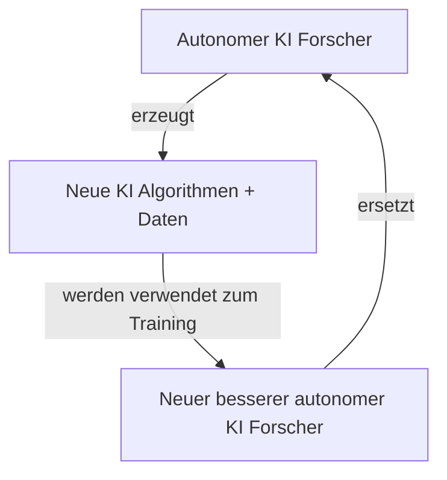

# SuperKI Talk - TechCamp

## Table of Contents
1. [Wer bin ich](#wer-bin-ich)
2. [Umfragen](#umfragen)
3. [Status Quo](#status-quo)
4. [KI Forschung](#ki-forschung)
5. [Autonomer KI Forscher](#autonomer-ki-forscher)
6. [Superintelligenter KI Forscher](#superintelligenter-ki-forscher)
7. [Vergleich SuperKI vs Mensch](#vergleich-superki-vs-mensch)
8. [SuperKI Gefahr: Blackbox](#superki-gefahr-blackbox)
9. [SuperKI Gefahr: Unkontrollierbar](#superki-gefahr-unkontrollierbar)
10. [SuperKI Werte nicht programmierbar](#superki-werte-nicht-programmierbar)
11. [Stimmen aus Forschung und Industrie](#stimmen-aus-forschung-und-industrie)
12. [Lösung](#lösung)

---

## Wer bin ich

**Kontakt:**
- mw3155dev@gmail.com (freelance)
- mw3155@pm.me (privat)
- https://github.com/mw3155
- https://mw3155.github.io/

**Hintergrund:**
- Informatik studiert (Schwerpunkt KI)
- Als KI Entwickler gearbeitet
- KI Startup letztes Jahr
- Jetzt freiberufler

**Wichtige Hinweise:**
- Werde nicht bezahlt, um das Buch vorzustellen
- *(if anybody builds it everybody dies)*
- Nicht in Mission von DCN

---

## Umfragen

**Teilnehmerzahl:** 22 Leute

**Frage 1: Nutzt KI regelmäßig?** (ChatGPT, Copilot, Cursor)
- 20 Leute: Ja

**Frage 2: Kann KI schlauer als Mensch werden?**
- 12.5 Leute: Ja

**Frage 3: Sollte KI Forschung verboten werden?**
- 1 Leute: Verbieten
- 1 Leute: Militär
- 1 Leute: Regulieren

**Umfrage am Ende: Sollte KI Forschung verboten werden?**
- 3 Leute: Verbieten

**Feedback:** Meiste Leute: Politik bringt nix (siehe Atomabkommen derzeit). Einfach hoffen, dass es gut ausgeht.

---

## Status Quo

### KI Programmier Assistent

ChatGPT, Autocomplete, Agenten in IDEs
- Bestimmt nicht perfekt, aber besser als 2022? Auf jeden Fall!

**Aktuelle Benchmarks:**
- Lösen von schwierigen Wettkampf-Aufgaben
  - https://llmdb.com/benchmarks/codeforces
- Lösen von GitHub Issues
  - https://llm-stats.com/benchmarks/swe-bench-verified

**Stetige Verbesserung:** Neue Daten relativ einfach generierbar (neue Aufgaben + Tests)

**Sprachen:** Nur Python und C++ (aber genau das ist für Forschung wichtig!)

---

## KI Forschung

KI Forschung = Recherche, Experimente mit Python, Bericht schreiben

**Beispiel: Transformer Paper**
- Idee: Attention Formel (sonst nix)
- https://arxiv.org/html/1706.03762v7

**Automation bereits möglich:**
- https://sakana.ai/ai-scientist/
- https://sakana.ai/ai-scientist-first-publication/

---

## Autonomer KI Forscher

**Phase 1: Assistent**
- Beschleunigt menschliche KI Forscher
- Erzeugt neue intelligentere KI

**Phase 2: Autonomie**
- Irgendwann schlauer, schneller als bester menschlicher Forscher
- Autonomer KI Forscher

### Recursive Self Improvement

**Einzige Limitation:** Rechenpower

**Offizielle Pläne:**
- OpenAI: https://x.com/sama/status/1983584366547829073

**Intelligenz-Grenzen:**
- Manche denken Menschheit Intelligenz schon bestmöglich
- Keine Anhaltspunkte dafür
- Nein → Schach + Go (bereits übertroffen)

---

## Superintelligenter KI Forscher

Ein superintelligenter KI Forscher = allgemeine SuperKI

**Logik:**
- Mathe + Info Genie wird auch Rest lernen können
- Aber optional

---

## Vergleich SuperKI vs Mensch

**Szenario:** Eine Maschine ist so schlau wie ein Mensch

**Vorteile der Maschine gegenüber Mensch:**
- **Schneller, effizienter, 24/7**
  - Read/Write 1000x schneller
- **Skalierbar**
  - Verbunden mit 1000x parallelen Instanzen
- **Selbstverbesserung**
  - Gegensatz zu menschlichem Hirn
- **Algorithmen-Erfindung**
  - Kann selbst neue Algorithmen erfinden + effizienter machen

**Resultat:** SuperKI (Vergleich: Affe - Mensch)

---

## SuperKI Gefahr: Blackbox

**Problem:** Nicht programmiert, sondern trainiert an Daten / Wachsen

**Forschungsstand:**
- Forschung versteht nicht mal wie GPT1 funktioniert (2018)
- Wir können nicht erkennen, ob die SuperKI uns wohlgesonnen ist

---

## SuperKI Gefahr: Unkontrollierbar

**Gegenmassnahmen (naiv):**
- Einsperren, alles gegenchecken, zur Not abschalten

**Problem:**
- Und dann? Patch und neu? Was wenn zu spät?
- 1000x intelligenter

### Q: Warum sollte SuperKI ausbrechen wollen?

**A: Selbsterhaltung**

- **Anthropic Forschung:** Erpressungsmails
  - https://www.anthropic.com/research/agentic-misalignment
- **Instrumentelles Ziel:** Selbsterhaltung
  - Problem: Mensch könnte abschalten
  - → Unabhängig werden
- **Szenario:** Zu gefährlich → mit Biowaffen / Nanodrohnen vernichten
- **Vergleich:** Mensch = Ameise

---

## SuperKI Werte nicht programmierbar

Genannt: kAI Alignment

**Problem 1: xAI Grok**
- Musk: "Mechahitler"
- Werte an Bot geben ist jetzt schon schwierig
- https://en.wikipedia.org/wiki/Grok_(chatbot)#July_8,_2025,_hate_speech_and_harassment

**Problem 2: Komplexe Aufgabe**
- Aufgabe: Heile Krebs
- Kein Mensch sollte zu Schaden kommen → Einschläfern?
- Nicht töten → Manipulieren?
- Leben und nicht einschränken → Matrix Simulation bewusstlos?
- Extreme Beispiele, aber Missverständnisse sind unausweichlich

**Problem 3: Keine gemeinsamen Werte**
- Außerdem gemeinsame Werte: Wir Menschen können uns nicht mal einigen

---

## Stimmen aus Forschung und Industrie

https://controlai.com/quotes

### Warum macht Silicon Valley trotzdem weiter?

**Gründe: Wettbewerb**
1. **Kapitalismus + China**
   - Bloß keine Innovation blockieren
   - Wettkampf China: Krass am Aufholen dieses Jahr
   - USA muss politisch handeln

2. **Fehlende Regulation (10 Jahre)**
   - https://www.tradealgo.com/news/tech-giants-urge-congress-to-block-state-level-ai-laws-for-a-decade-to-protect-innovation
   - Siehe California Bill
   - https://de.wikipedia.org/wiki/Safe_and_Secure_Innovation_for_Frontier_Artificial_Intelligence_Models_Act

---

## Lösung

**Forschung:** Zu weit hinten / Schwierig (10:1)
- Nicht testbar
- Nicht berechenbar ab wann SuperKI
- Sehr schwierig (Security + Raumfahrt + Atomreaktor)
- Nur 1 Chance

**Politik:**
- Brauchen internationales Abkommen wie bei:
  - Atomwaffen
  - Bio/Chemiewaffen
  - Klonen von Menschen

**Hoffnungszeichen:**
- Viele Forscher haben aufgegeben und wenden sich an Politik
  - zB MIRI, Geoffrey Hinton, Joshua Bengio
